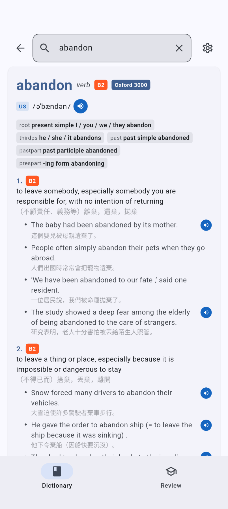
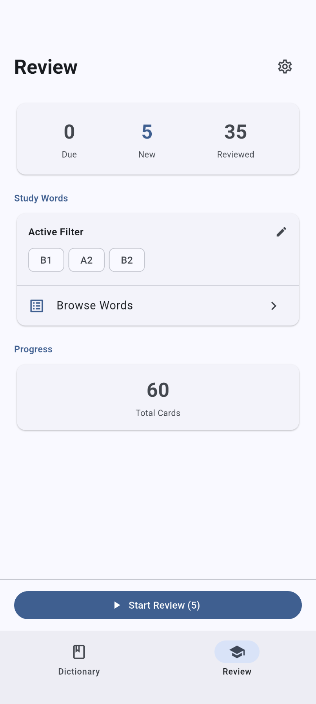

# Deckionary

**你的牛津詞典，你的單字卡，一個 App 搞定。**

以《牛津高階英漢雙解詞典》第十版為基礎，結合間隔重複學習、即時查詢與跨裝置同步的詞典學習 App。

[下載](#下載) · [功能介紹](#功能介紹) · [English](README.md)

---

<!-- 請將以下替換為實際截圖 -->

  
  &nbsp;&nbsp;
  
  &nbsp;&nbsp;
  

---

## 功能介紹

### 完整牛津詞典，隨手可查
查詢任何單字，獲得完整的 OALD10 詞條——定義、例句、發音（美式與英式）、動詞變化、搭配詞、同義詞、詞彙家族等。Oxford 3000/5000 與 CEFR 等級標示幫助你專注在最重要的詞彙上。

### 間隔重複，高效記憶
內建 FSRS 演算法在最佳時機安排複習。每張卡片以「重來 / 困難 / 良好 / 簡單」評分，系統自動適應你的記憶曲線。可自訂每日新卡與複習數量上限，照自己的步調學習。

### macOS 即時查詢
在任何應用程式中按下 **Cmd+Shift+D** 即可彈出詞典視窗，無需切換畫面。支援剪貼簿自動搜尋——複製一個單字，按快捷鍵就能查詢。跨桌面、跨螢幕皆可使用。

### 跨裝置同步
使用 Google 帳號登入，搜尋紀錄、單字卡進度與設定在所有裝置間自動同步。離線優先架構——一切資料在恢復網路後自動同步。

### 聆聽與發音
點擊即可聽取美式或英式發音，支援詞條、動詞變化與例句音檔。開啟自動發音，搜尋或複習時每個單字都會自動朗讀。

## 下載

前往 [GitHub Releases](https://github.com/XuanLongHuang/oxford-5000-to-anki/releases) 取得最新版本：

- **macOS** — `.zip`（通用二進位）
- **Android** — `.apk`
- **iOS** — 即將推出
